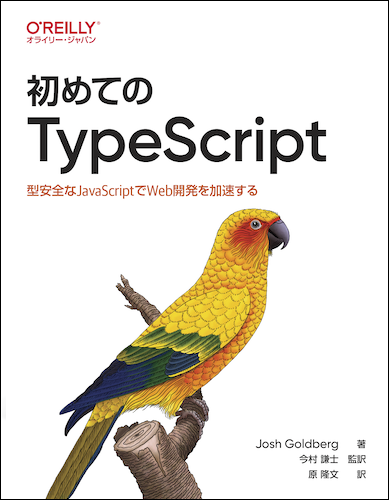

# 初めてのTypeScript

---



---

本リポジトリはオライリー・ジャパン発行書籍『[初めてのTypeScript](https://www.amazon.co.jp/dp/4814400365/)』のサポートサイトです。

## 構成

```
.
├── README.md
├── code
│   ├── ch01.ts   // 1章のコードスニペット
│   ├── ch02.ts   // 2章のコードスニペット
│   ├── ch03.ts   // ...
│   ├── ch04.ts
│   ├── ch05.ts
│   ├── ch06.ts
│   ├── ch07.ts
│   ├── ch08.ts
│   ├── ch09.ts
│   ├── ch10.ts
│   ├── ch11.ts
│   ├── ch13.ts
│   ├── ch14.ts
│   └── ch15.ts
└── learning-typescript-ja.png
```

サンプルコードの解説は本書籍をご覧ください。

## 正誤表

本書の正誤情報は以下のページで公開しています。

https://github.com/oreilly-japan/learningtypescript-ja/wiki/errata

本ページに掲載されていない誤植など間違いを見つけた方は、[japan＠oreilly.co.jp](<mailto:japan＠oreilly.co.jp>)までお知らせください。
